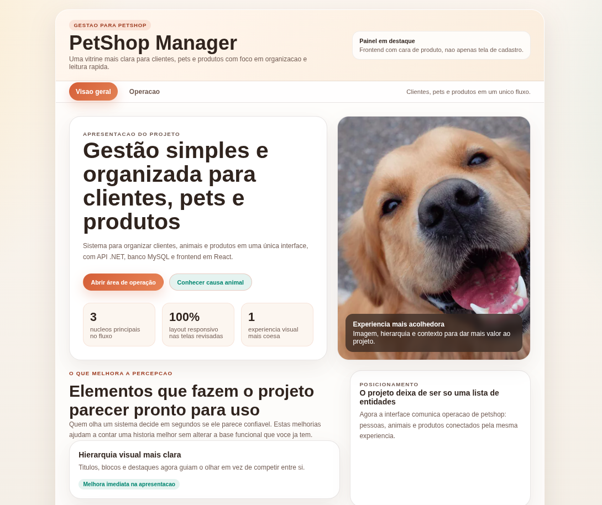
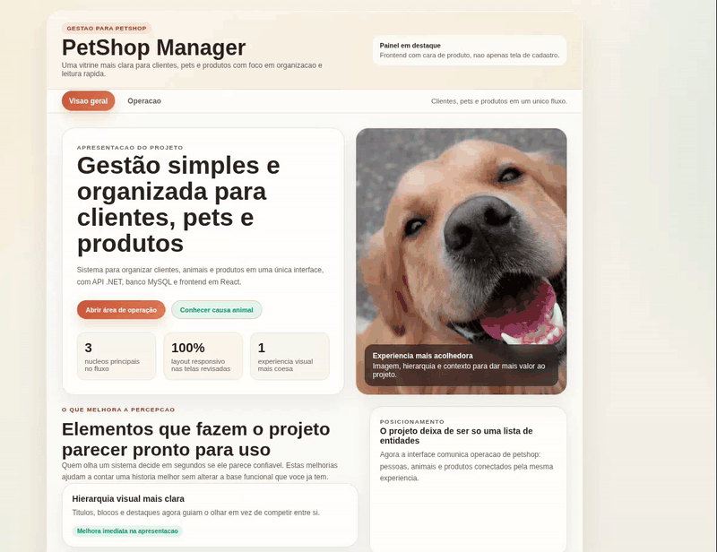

# 🐾 Gerenciamento Petshop

Sistema web full stack para gerenciamento de petshop, desenvolvido com **ASP.NET Core, React, Entity Framework Core e MySQL**.

A aplicação permite gerenciar clientes, animais e produtos por meio de uma **API REST integrada a uma interface web responsiva**, com persistência de dados em MySQL e ambiente de backend preparado com Docker.

---

## 📸 Demonstração

### Visão geral



### Sistema em funcionamento



---

## 📋 Sobre o projeto

O **Gerenciamento Petshop** foi desenvolvido para colocar em prática conceitos de desenvolvimento full stack através de uma aplicação que centraliza informações de clientes, animais e produtos.

O sistema possui uma interface desenvolvida em **React**, responsável pela interação com o usuário, que se comunica através de requisições HTTP com uma **API REST em ASP.NET Core**.

No backend, o **Entity Framework Core** realiza o acesso e a persistência dos dados em um banco **MySQL**.

Além do desenvolvimento da aplicação, o projeto também utiliza **Docker Compose**, variáveis de ambiente e Swagger para facilitar a configuração, execução e documentação da API.

---

## ✨ Funcionalidades

- 👤 Cadastro e visualização de clientes
- 🐶 Cadastro e visualização de animais
- 📦 Cadastro e visualização de produtos
- 💰 Exibição e formatação de valores de produtos
- 🔄 Integração entre frontend e API REST
- 🗄️ Persistência dos dados em MySQL
- 📱 Interface responsiva para diferentes tamanhos de tela
- 📚 Documentação e testes dos endpoints através do Swagger

---

## 🛠️ Tecnologias utilizadas

### Backend

- **C#**
- **.NET 8**
- **ASP.NET Core**
- **Entity Framework Core**
- **MySQL**
- **Swagger / OpenAPI**

### Frontend

- **React**
- **JavaScript**
- **HTML**
- **CSS**
- **Axios**

### Ambiente e ferramentas

- **Docker**
- **Docker Compose**
- **Git**
- **GitHub**

---

## 🏗️ Arquitetura da aplicação

A aplicação é dividida em três componentes principais:

```text
┌─────────────────────┐
│        React        │
│      Frontend       │
└─────────┬───────────┘
          │
          │ HTTP / REST
          ▼
┌─────────────────────┐
│   ASP.NET Core API  │
│       Backend       │
└─────────┬───────────┘
          │
          │ Entity Framework Core
          ▼
┌─────────────────────┐
│        MySQL        │
│   Banco de dados    │
└─────────────────────┘
```

O frontend realiza requisições HTTP para a API ASP.NET Core.

A API é responsável pelo processamento das requisições e pelo acesso ao banco de dados através do **Entity Framework Core**.

---

## 🔗 API REST

O backend disponibiliza uma API REST responsável pelas operações relacionadas a:

- Clientes
- Animais
- Produtos

Com a aplicação em execução, a documentação completa da API pode ser acessada através do Swagger:

```text
http://localhost:5119/swagger
```

O Swagger permite visualizar os endpoints disponíveis, os modelos utilizados e testar as requisições diretamente pelo navegador.

---

## 📁 Estrutura do projeto

```text
gerenciamento-petshop/
│
├── app-front/
│   ├── public/
│   ├── src/
│   ├── .env.example
│   ├── package.json
│   └── README.md
│
├── backend/
│   ├── Controllers/
│   ├── Models/
│   ├── Migrations/
│   ├── Dockerfile
│   └── PetShopManagement.Api.csproj
│
├── docs/
│   ├── screenshots/
│   │   └── tela-principal.png
│   │
│   └── demo/
│       └── gerenciamento-petshop.gif
│
├── .env.example
├── .gitignore
├── docker-compose.yml
└── README.md
```

---

# 🚀 Como executar o projeto

A forma recomendada de executar o backend e o banco de dados é utilizando **Docker Compose**.

O frontend React é iniciado separadamente através do Node.js.

## Pré-requisitos

Antes de começar, tenha instalado:

- [Git](https://git-scm.com/)
- [Docker](https://www.docker.com/)
- Docker Compose
- [Node.js](https://nodejs.org/)
- npm

---

## 1. Clone o repositório

```bash
git clone https://github.com/GabrielDittrich/gerenciamento-petshop.git
```

Entre na pasta do projeto:

```bash
cd gerenciamento-petshop
```

---

## 2. Configure as variáveis de ambiente

Na raiz do projeto existe o arquivo:

```text
.env.example
```

Crie um arquivo `.env` a partir dele.

### Linux / macOS

```bash
cp .env.example .env
```

### Windows

```bash
copy .env.example .env
```

O arquivo possui as configurações utilizadas pelo MySQL:

```env
MYSQL_ROOT_PASSWORD=sua_senha_root
MYSQL_DATABASE=petshopdb
MYSQL_USER=petshop
MYSQL_PASSWORD=sua_senha_usuario
```

As senhas podem ser alteradas antes da inicialização dos containers.

> Os arquivos `.env` armazenam configurações locais e não devem ser versionados. O `.env.example` serve como modelo para configuração do ambiente.

---

## 3. Inicie o banco de dados e a API

Na raiz do projeto, execute:

```bash
docker compose up --build
```

O Docker Compose irá:

1. Baixar a imagem do MySQL, caso ainda não esteja disponível
2. Criar e iniciar o banco de dados
3. Executar o healthcheck do MySQL
4. Compilar a API ASP.NET Core
5. Inicializar o backend após o banco estar disponível

Após a inicialização:

| Serviço | Endereço |
|---|---|
| API | http://localhost:5119 |
| Swagger | http://localhost:5119/swagger |
| MySQL | localhost:3307 |

Dentro da rede Docker, a API acessa o banco através de:

```text
db:3306
```

---

## 4. Configure o frontend

Abra outro terminal e acesse:

```bash
cd app-front
```

O frontend possui seu próprio arquivo:

```text
.env.example
```

Crie o `.env`.

### Linux / macOS

```bash
cp .env.example .env
```

### Windows

```bash
copy .env.example .env
```

A configuração padrão é:

```env
REACT_APP_API_URL=http://localhost:5119
```

Essa variável define o endereço utilizado pelo React para se comunicar com a API.

---

## 5. Instale as dependências

Dentro de `app-front`, execute:

```bash
npm install
```

---

## 6. Inicie o frontend

```bash
npm start
```

A aplicação estará disponível em:

```text
http://localhost:3000
```

---

## ✅ Aplicação em execução

Com todos os serviços iniciados:

| Aplicação | Endereço |
|---|---|
| Frontend React | http://localhost:3000 |
| Backend ASP.NET Core | http://localhost:5119 |
| Swagger | http://localhost:5119/swagger |
| MySQL | localhost:3307 |

---

## 🛑 Encerrando os containers

Para interromper o backend e o banco:

```bash
docker compose down
```

Os dados do MySQL permanecem armazenados no volume Docker.

Ao executar novamente:

```bash
docker compose up
```

os dados cadastrados anteriormente continuarão disponíveis.

### Remover também os dados

Para remover os containers e o volume do banco:

```bash
docker compose down -v
```

> ⚠️ O parâmetro `-v` remove o volume do MySQL e apaga os dados armazenados nele.

---

## ⚙️ Executando o backend sem Docker

Também é possível executar a API diretamente utilizando o .NET SDK.

### Pré-requisitos

- .NET 8 SDK
- MySQL
- Banco configurado
- String de conexão válida

Entre na pasta:

```bash
cd backend
```

Restaure as dependências:

```bash
dotnet restore
```

Execute:

```bash
dotnet run
```

Nesse modo, é necessário garantir que a configuração de conexão com o MySQL esteja adequada ao ambiente local.

---

## 🐳 Ambiente Docker

O ambiente utiliza **MySQL 8.4** com persistência através de volume Docker.

O banco possui um **healthcheck**, utilizado pelo Docker Compose para verificar quando o MySQL está pronto para receber conexões.

A API ASP.NET Core só é iniciada depois que o banco estiver disponível, evitando tentativas de conexão enquanto o MySQL ainda está sendo inicializado.

---

## 📱 Responsividade

A interface foi desenvolvida para se adaptar a diferentes tamanhos de tela.

O sistema pode ser utilizado em:

- Desktop
- Notebook
- Tablet
- Smartphone

---

## 💡 Conceitos aplicados

Durante o desenvolvimento do projeto foram aplicados conceitos como:

- Desenvolvimento de APIs REST
- ASP.NET Core
- Entity Framework Core
- Persistência de dados
- Migrations
- Integração com MySQL
- Integração entre frontend e backend
- Requisições HTTP
- Configuração de CORS
- Variáveis de ambiente
- Docker e Docker Compose
- Persistência com volumes Docker
- Healthcheck de containers
- Swagger / OpenAPI
- Interfaces responsivas
- Git e GitHub

---

## 📌 Status do projeto

✅ **Funcional**

O projeto possui integração entre **frontend, backend e banco de dados** e pode ser executado localmente utilizando Docker.

---

## 👨‍💻 Autor

**Gabriel Dittrich**

Desenvolvedor de Software em início de carreira com foco em **C#, .NET, ASP.NET Core, SQL, APIs REST e React**.

[LinkedIn](https://www.linkedin.com/in/gabriel-dittrich/) • [GitHub](https://github.com/GabrielDittrich)
